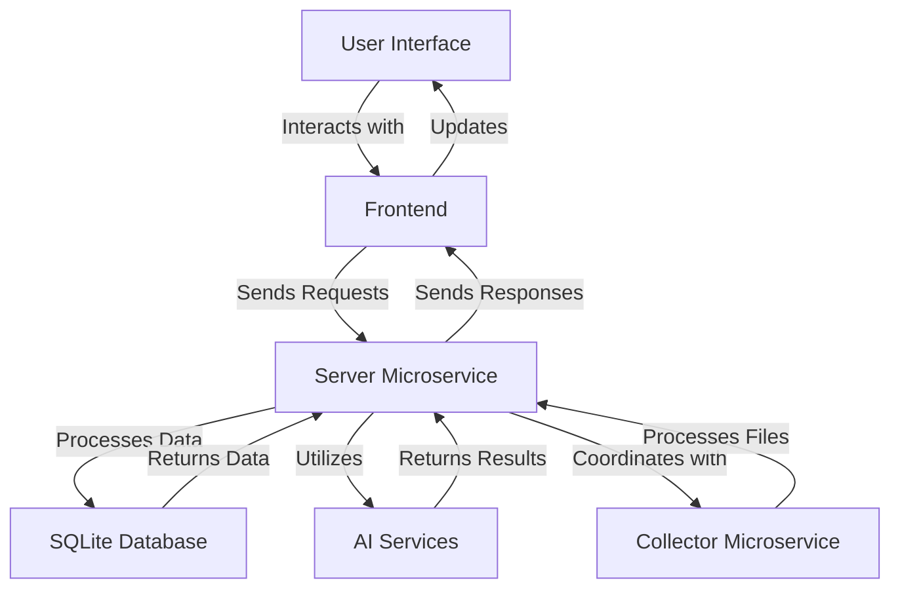
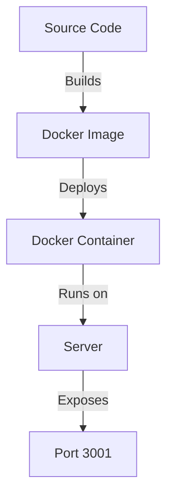

# Athena Application Technical Documentation

## Introduction
The Athena application is designed to provide server endpoints for processing or creating content for chatting. It is structured with a frontend built using React and a backend powered by Node.js, Express, and various AI-related libraries. The application is divided into three main microservices: the frontend, the server, and the collector.

## Frontend
The frontend of the Athena application is built using React and includes several key components and context providers:
- **App**: The main application component.
- **AuthContext**: Manages authentication state.
- **LogoContext**: Handles the fetching and management of instance logos.
- **PfpContext**: Manages profile picture fetching and updates.
- **ThemeContext**: Provides theme-related functionalities.

### Dependencies
The frontend relies on a variety of libraries, including:
- `react`, `react-dom` for building UI components.
- `react-router-dom` for routing.
- `i18next` for internationalization.
- `tailwindcss` for styling.

## Backend
The backend is structured with server endpoints and utilities, supporting a microservices architecture. It processes requests and interacts with various AI and database services.

### Server Microservice
- **Functionality**: Handles API requests, processes data, and interacts with databases and AI services.
- **Dependencies**: Uses libraries such as `express`, `jsonwebtoken`, `prisma`, and AI-related libraries like `@anthropic-ai/sdk` and `openai`.

### Collector Microservice
- **Functionality**: Responsible for processing files and data collection tasks.
- **Dependencies**: Utilizes libraries for file processing and data management.

## Deployment
The Athena application is containerized using Docker, with configurations defined in `docker-compose.yml`. It includes:
- A custom network `athena-llm`.
- A service `athena-llm` that builds from a Dockerfile and exposes port 3001.

### Required Services for Deployment
- **Docker**: For containerization and deployment.
- **Node.js**: To run the server and collector microservices.
- **SQLite**: Currently used as the database for storing application data.

### Docker Deployment Command
To deploy the Athena application using Docker, the following command is used:

```bash
export STORAGE_LOCATION=$HOME/athena && \
docker run -d --name athena -p 3001:3001 \
--cap-add SYS_ADMIN \
-v ${STORAGE_LOCATION}:/app/server/storage \
-v ${STORAGE_LOCATION}/.env:/app/server/.env \
-e STORAGE_DIR="/app/server/storage" \
surajsinghania82/athena-llm:latest
```

#### Command Breakdown
- **STORAGE_LOCATION**: Sets the storage location on the host machine.
- **docker run**: Runs the Docker container in detached mode.
- **--name athena**: Names the container "athena".
- **-p 3001:3001**: Maps port 3001 on the host to port 3001 in the container.
- **--cap-add SYS_ADMIN**: Adds the SYS_ADMIN capability to the container.
- **-v ${STORAGE_LOCATION}:/app/server/storage**: Mounts the storage directory from the host to the container.
- **-v ${STORAGE_LOCATION}/.env:/app/server/.env**: Mounts the .env file from the host to the container.
- **-e STORAGE_DIR="/app/server/storage"**: Sets the STORAGE_DIR environment variable within the container.

### Managing Logs
To view and manage logs for the Athena application, you can use the following Docker commands:

- **View Logs**: To view the logs of the running container, use:
  ```bash
  docker logs athena
  ```

- **Follow Logs**: To continuously view the logs as they are generated, use:
  ```bash
  docker logs -f athena
  ```

- **Inspect Container**: To get detailed information about the container, use:
  ```bash
  docker inspect athena
  ```

## Diagrams
### Architecture Flow


### Deployment Flow


These diagrams provide a visual representation of the Athena application's architecture and deployment flow, aiding in understanding the system's structure and interactions.
